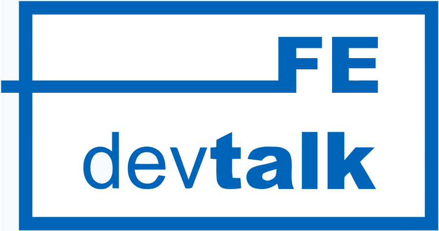

# FE devtalk

**FE devtalk** 은 `NAVER`에서 진행하는 **사내 프론트엔드 컨퍼런스**입니다.([네이버 다이어리 참고](https://m.blog.naver.com/PostView.nhn?blogId=naver_diary&logNo=221667928848&navType=tl)) Front-End 기술과 관련된 모든 영역의 내용들을 공유하고 토론할 수 있는 사내 컨퍼런스로 다양한 서비스 개발 경험들과 노하우를 개발자로부터 직접 들을 수 있는 자리입니다. 매 3 개월(분기) 마다 진행이 되고 있으며 2015년 부터 지금까지 운영하고 있습니다. 참석자 또한 점점 늘어나면서 지난 FE devtalk에는 250 명이 넘는 분들이 참석해주셨습니다.

저희 **FE devtalk Organizer**는 참석자 분들께 관련 주제에 대한 질 높은 정보를 전달하기 위해 사내 연사자, 외부 연사자 모두 상시 모집 중에 있습니다. 각 회차마다 다루고자 하는 ‘테마(프론트엔드 분야에서 기술적으로 분류할 수 있는 주제군)’를 정하고 그에 맞는 ‘주제'를 선정하여 **연사를 모집**하고 있습니다.

## JFYI

- **연사로 오셔서 경험과 지식을 공유해주실 경우, '소정의 사례'와 상패를 드립니다.**
- 이번 회차와는 인연이 맞지 않아 지원을 못하셨더라도 자신이 자신있는 분야가 있어서 발표를 원하신다면 오거나이저에게 개인적으로 연락주시거나 [ISSUE](https://github.com/NAVER-FEPlatform/FEDevtalk/issues)에 등록해주세요! 추후 컨퍼런스의 테마와 맞는 분이시라면 연락드리겠습니다.
- 행사에서 다뤘으면 하는 프론트엔드 분야와 관련된 좋은 테마, 주제가 있다면 이 또한 [ISSUE](https://github.com/NAVER-FEPlatform/FEDevtalk/issues)에 등록해주세요! 다음 FE devtalk 기획 시 참고하겠습니다.
- 아쉽게도 행사 관리의 문제로 **외부 참석자는 참가 신청을 받지 않고 있습니다.** 대신 연사자 분들이 발표하신 내용은 연사자 동의하에 높은 퀄리티로 촬영이 이루어지며 이는 추후 편집을 거쳐 발표자료와 함께 Youtube 에 공개됩니다.

### 진행 중인 FEdevtalk
- [FEdevtalk 17회](https://github.com/NAVER-FEPlatform/FEDevtalk/blob/master/17_fedevtalk.md)

### 지난 FEdevtalk
- [FEdevtalk 16회](https://github.com/NAVER-FEPlatform/FEDevtalk/blob/master/16_fedevtalk.md)
- [FEdevtalk 15회](https://github.com/NAVER-FEPlatform/FEDevtalk/blob/master/15_fedevtalk.md)
- [FEdevtalk 14회](https://github.com/NAVER-FEPlatform/FEDevtalk/blob/master/14_fedevtalk.md)
- [FEdevtalk 13회](https://github.com/NAVER-FEPlatform/FEDevtalk/blob/master/13_fedevtalk.md)
- [FEdevtalk 12회](https://github.com/NAVER-FEPlatform/FEDevtalk/blob/master/12_fedevtalk.md)
- [FEdevtalk 11회](https://github.com/NAVER-FEPlatform/FEDevtalk/blob/master/11_fedevtalk.md)
- [FEdevtalk 10회](https://github.com/NAVER-FEPlatform/FEDevtalk/blob/master/10_fedevtalk.md)

## Organizers

- [전용우@mixed](https://github.com/mixed)
- [김도윤@BillionaireDY](https://github.com/BillionaireDY)
- [김현준@henjun](https://github.com/henjun)
- [최연규@daybrush](https://github.com/daybrush)
- [김민규@woodneck](https://github.com/woodneck)
- [이은빈@fed-gren](https://github.com/fed-gren)
- [김재원@load0ne](https://github.com/load0ne)
- [우혜주@hzoou](https://github.com/hzoou)
- [NAVER FE Platform Team](https://medium.com/naver-fe-platform)
- 본 행사는 [NAVER D2](https://d2.naver.com/home) 의 후원을 받고 있습니다.

### 지난 운영자
- [한재엽@JaeYeopHan](http://github.com/JaeYeopHan)
- [이관형@sphilee](https://github.com/sphilee)

## Related Links

- [FE devtalk NaverTV](https://tv.naver.com/naverd2)
- [FE devtalk Youtube](https://www.youtube.com/playlist?list=PLsFtzQAC8dDcv76FW0MDTTYVgnVrsW3sW)
- [NAVER Tech Talk News](https://d2.naver.com/search?keyword=teck%20talk)
